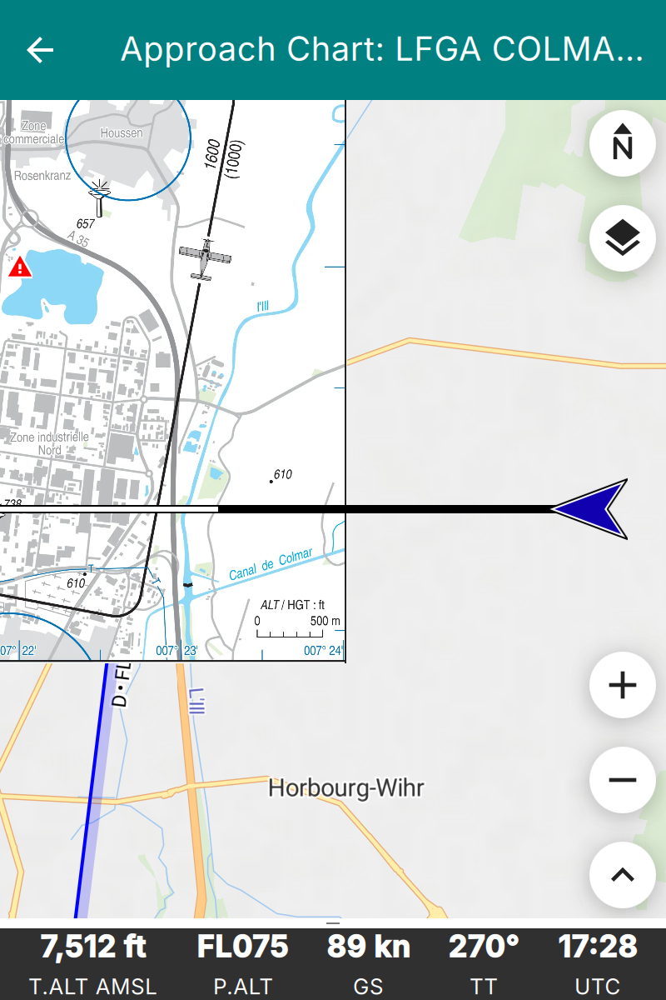

.. _vac_tutorial:

Visual Approach Charts
======================

**Enroute Flight Navigation** can display visual approach charts on the moving
map.  The figure :ref:`vacImg` shows how this will typically look.

.. _vacImg:

   Moving map display with embedded approach chart

There are two ways to get approach charts onto your device.

- For some countries, we distribute chart collections together with the country
  maps.  The charts are installed and updated along with the maps, and no
  further action is required on your part.  The section :ref:`vacDownload`
  explains the details.

- You can import your own chart files, as explained in the section
  :ref:`vacImport`.

.. _vacDownload:

Download Approach Chart Collections
-----------------------------------

For some countries, we distribute a collection of approach charts as part of the
country's map set.  At present, this is the case for France, whose charts are
kindly provided by the `Service de l'Information Aéronautique (SIA)
<https://www.sia.aviation-civile.gouv.fr/>`_.  The section :ref:`vacData` lists
the collections that are currently available, and the section :ref:`licensePage`
describes the licenses under which the charts are distributed.

To install a collection, simply install the country map: on the moving map
screen, open the main menu and go to "Library/Maps and Data".  The page "Map and
Data Library" will then open.  Its "Maps" tab lists the available countries; map
sets that contain approach charts show an entry "Approach Charts" in their
description.

Once installed, the charts are available immediately.  They are updated whenever
you update the country map, and they are removed when you uninstall it.

.. note:: Not all countries have chart collections.  If the country map that you
  are interested in does not offer approach charts, you can still import charts
  yourself, as described in the section :ref:`vacImport`.

.. _vacImport:

Import Approach Charts
----------------------

**Enroute Flight Navigation** accepts visual approach charts in one of the
following formats.

- Geo-referenced image files in GeoTIFF format.

- TripKits that contain collections of approach charts for a specific area or
  flight route. The `AIP Browser DE
  <https://mpmediasoft.de/products/AIPBrowserDE/help/AIPBrowserDE.html>`_ can
  produce TripKits for Germany.

.. note:: GeoTIFF is a complex format that supports many use cases, ranging
  from astronomy to high-precision land survey. **Enroute Flight Navigation**
  only supports a subset of the GeoTIFF standard. If you encounter a GeoTIFF
  file that **Enroute Flight Navigation** does not recognize, see the
  section :ref:`geotiffConversionTools` for possible remedies.

Obtain Approach Chart Files
~~~~~~~~~~~~~~~~~~~~~~~~~~~

- Michael Paus' free software `AIP Browser DE
  <https://mpmediasoft.de/products/AIPBrowserDE/help/AIPBrowserDE.html>`_ can
  generate GeoTIFF images and TripKits for all German airfields. The data comes
  from Germany's official `AIP <https://aip.dfs.de/basicAIP>`_, as provided by
  `DFS Deutsche Flugsicherung GmbH <https://www.dfs.de/homepage>`_.

- `GeoRef Tool <https://georefsite.onrender.com/>`_ is a free, web-based
  application that allows users to upload an image (e.g., aerodrome charts,
  approach plates) and manually georeference it by assigning reference points.
  The tool then generates a GeoTIFF file that can be imported into **Enroute
  Flight Navigation** or other flight navigation software. This enables pilots
  and navigators to integrate custom maps with accurate geographic positioning,
  enhancing situational awareness during flight planning and navigation.

  For more details, visit the `GeoRef Tool Website <https://georefsite.onrender.com/>`_.

Please get in touch with us if you are aware of other data sources. We will be
glad to list them here.

Import Approach Chart Files
~~~~~~~~~~~~~~~~~~~~~~~~~~~

Transfer the GeoTIFF or TripKit file to your device and open the file on your
device.  The Section :ref:`importData` explains the process in detail.

.. note:: TripKits are ZIP files with specialized content. Trying to open a
  TripKit file, some file management utilities will automatically unpack the ZIP
  file rather than offering to open it in **Enroute Flight Navigation**.  Along
  similar lines, GeoTIFF files are image files with specialized metadata and some
  file management utilities will launch an image viewing application rather than
  offering to open a GeoTIFF file in **Enroute Flight Navigation**.

  If you encounter problems opening a TripKit or GeoTIFF file, look for an icon
  or menu item labeled "Open with…".  Some utilities open an appropriate context
  menu after a tap-and-hold gesture.

Manage Your Approach Chart Library
----------------------------------

On the moving map screen, open the main menu and go to "Library/Maps and Data".
The page "Map and Data Library" will then open. The page has a "VAC" tab listing
all approach charts installed on your device, whether downloaded or imported.
The charts are grouped by origin: charts that came with a country map appear
under the name of their collection, while charts that you imported yourself
appear under the heading "Manually Imported".

Use the context menus to retrieve basic information about a chart.  The context
menu entries "Rename" and "Uninstall" are available only for charts that you
imported yourself.  Charts that came with a country map are removed together
with that map, on the "Maps" tab of the same page.

The three-dot menu at the top right of the screen allows clearing your approach
chart library.  This removes the charts that you imported yourself; charts that
came with a country map are not affected.

Use Approach Charts
-------------------

Once approach charts are installed, open the main menu and go to "Approach
Charts". The page "Visual Approach Charts" will then open. The page lists all
approach charts installed in your device, sorted by distance to the current
position.  Below each chart name, a second line indicates the origin of the
chart, such as "manually imported" or the name of the collection that the chart
belongs to.  Tap on a chart to open "Approach Chart" page, which shows a slightly
simplified moving map with the approach chart superimposed on top of the usual
map layer. As usual, tap on the left arrow symbol in the page title to close the
page and return to the standard moving map display.

In order to avoid surprises in flight, **Enroute Flight Navigation** will not
open the approach chart page automatically.

.. note:: The menu entry "Approach Charts" is only visible if approach
  charts are installed on your device. If you cannot find the menu entry,
  install some approach charts first.
