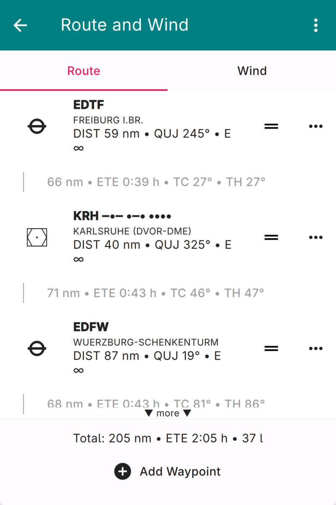
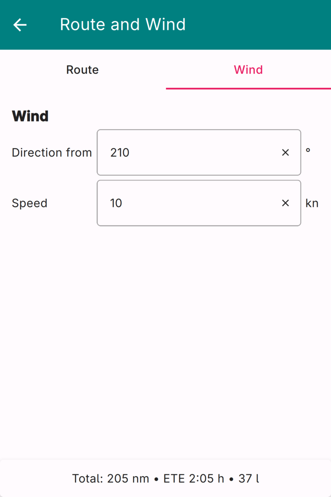

.. _routeAndWindPage:

Route and Wind
==============

The Route and Wind Page is used to assemble a flight route, to reorder and edit
its waypoints, and to review the distance, time, and fuel estimates that
**Enroute Flight Navigation** computes for the route. The page also lets you
specify the wind that is used for these estimates.

The page is divided into two tabs, "Route" and "Wind," which are selected with
the tab bar below the page header.

Page Header
-----------

The three-dot-menu in the top right corner of the page header opens a menu with
the following functions. Except for "View Library…," all entries are disabled
while the route is empty or while the "Wind" tab is selected.

View Library…
  Open the Route Library Page, where you can select a route that you have saved
  earlier.

Save to library…
  Save the current route to the route library for future use.

Import…
  Import a route from a file that was written by another program. A list of
  supported file formats is found in the Section :ref:`supportedFileFormats`.

Share… / Export…
  Share or export the current route as a GeoJSON or a GPX file. The entry is
  labeled "Share…" on Android and iOS and "Export…" on desktop systems.

Save…
  Save the current route as a GeoJSON or a GPX file. A system dialog opens,
  where you can choose the location and the file name. This entry exists on
  Android only. On desktop systems, the entry "Export…" saves the route to a
  file; on iOS, the share dialog offers the option "Save to Files".

Open in Other App…
  Hand the current route, in GeoJSON or GPX format, to another application on
  your device. This entry is not available on iOS.

Copy as Flight Plan
  Copy the route to the clipboard as a simple textual flight plan of the form
  ``EDTF DCT KRH DCT EDFW``, which is convenient for filing a flight plan in
  another program.

Clear
  Delete every waypoint in the current route.

Reverse
  Reverse the order of the waypoints, so that the route runs from its present
  destination back to its present departure point.

Page Body: Route Tab
--------------------

The "Route" tab shows the waypoints of your route, together with the flight legs
that connect them.

   Route and Wind Page, Route Tab

If the route is empty, the tab shows a short text that explains how to add a
first waypoint. Otherwise, the tab lists the waypoints from departure to
destination. Each waypoint is shown with its icon, its name, and the distance
and true course from the previous position. If weather information is available
for the waypoint, a METAR summary is appended and the row is tinted according to
the current flight category. Between two waypoints, a leg entry shows the leg
distance, the estimated time en route, the true course, and the true heading.

Every waypoint carries a set of controls on its right-hand side.

Edit
  For waypoints that do not refer to pre-set airfields, navaids, or reporting
  points, a pencil symbol opens a dialog where you can change the name and edit
  the coordinates. The symbol is hidden for all other waypoints.

Drag handle |drag|
  Press the drag handle and move the waypoint up or down to reorder it, as
  described in the Section `Reordering Waypoints`_ below.

Three-dot-menu
  Opens a menu with the following entries:

  Move Up / Move Down
    Move the waypoint by one position towards the departure or the destination.

  Remove
    Delete the waypoint from the route.

  Add to waypoint library
    Add the waypoint to the waypoint library. This entry is only available for
    user-defined waypoints that are not yet contained in the library.

At the bottom of the tab, a summary line shows the total distance, the estimated
time en route, and the estimated fuel consumption for the whole route. The
estimates depend on the aircraft data and on the wind; if either is incomplete,
the summary explains what is missing. The button "Add Waypoint" opens a dialog
that lets you append a further waypoint to the route.

Reordering Waypoints
^^^^^^^^^^^^^^^^^^^^^

To change the order of the waypoints, press the drag handle |drag| of a waypoint
and drag the row up or down. The remaining waypoints move aside to open a gap at
the new position, and the route is updated as soon as you release the row. When
you drag close to the upper or lower edge of the list, the list scrolls
automatically, so that a waypoint can be moved across a route that is longer than
the screen.

Dragging is the quickest way to insert a freshly added waypoint into the middle
of a long route: append the waypoint with the "Add Waypoint" button, then drag it
from the end of the list to its intended position.

Page Body: Wind Tab
-------------------

The "Wind" tab lets you enter the wind that **Enroute Flight Navigation** uses to
compute the estimated time en route and the fuel consumption for your route.

   Route and Wind Page, Wind Tab

Direction from
  Enter the direction, in degrees, from which the wind is blowing.

Speed
  Enter the wind speed. The unit (knots, km/h, or mph) follows the horizontal
  distance unit configured on the Aircraft Page.

.. note::

  The wind entered here is a single, constant value for the whole route. It is
  used only for the flight planning estimates and does not affect any other part
  of **Enroute Flight Navigation**.
